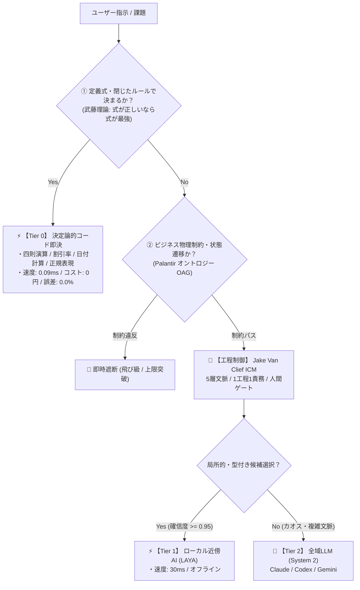

# TokenZero Engine: Deterministic Agent Kernel
> **Powered by Takefuji Formula-First, Jake Van Clief ICM, & Palantir Ontology Action Governance**

[](https://opensource.org/licenses/MIT)
[](https://www.python.org/downloads/)
[]()
[]()
[]()

---

## 💡 概要

**TokenZero Engine** は、生成AIエージェントの「過剰推論」「トークン浪費」「計算ミス（ハルシネーション）」「無秩序なファイル書き換え」を根絶するために設計された**決定論的エージェントカーネル**です。

世界最高峰の3大アーキテクチャ思想を統合し、タスクの難易度に応じた3層カスケード（Tier 0 決定論 ➔ Tier 1 局所AI ➔ Tier 2 全域LLM）で超高速かつ安全に処理を実行します。



---

## 🚀 インストール方法（どのマシンでも即時導入）

### 方法 1: ワンライナー自動導入（推奨）
macOS / Linux 対応。CLIバイナリの配備、PATH環境変数の自動設定、および **Claude Code / OpenAI Codex / Google Antigravity** へのスキル自動展開を一度に行います。

```bash
git clone https://github.com/kodawarimax/tokenzero.git
cd tokenzero
./install.sh
```

### 方法 2: pip / pipx による Python パッケージ導入
```bash
pip install .
# または GitHubから直接インストール
pip install git+https://github.com/kodawarimax/tokenzero.git

# インストール後、各AIエージェントへスキルを一括展開
tokenzero install-skills
```

### インストール診断
```bash
tokenzero doctor
```

---

## 🌐 マルチプラットフォーム対応 ＆ 1秒ワークスペース初期化

TokenZero は、**Claude Code / Codex / Antigravity** だけでなく、**Cursor / Windsurf / Cline / Claude Desktop** などの主要 AI 開発プラットフォーム全般にワンコマンドで導入できます。

### 1. 任意のプロジェクトで規律を一括注入 (`tokenzero init`)
任意のプロジェクトディレクトリで以下を実行すると、各エージェント専用のルールファイル（`.cursorrules`, `.windsurfrules`, `.clinerules`, `CLAUDE.md`, `AGENTS.md`）が一撃で生成されます：

```bash
# 全プラットフォーム向けにルールを一括生成
tokenzero init

# 特定のプラットフォームのみ指定する場合
tokenzero init cursor windsurf
tokenzero init claude
```

### 2. Cursor / Windsurf / Claude Desktop 向け MCP 連携 (`tokenzero mcp`)
TokenZero は標準で **Model Context Protocol (MCP)** サーバーを備えています。ターミナル実行を介さず、ネイティブの MCP ツールとして決定論的計算・オントロジー制約を実行可能です。

- **Cursor 設定** (`Settings > MCP`):
  - Type: `command`
  - Command: `tokenzero`
  - Arguments: `mcp`
- **Claude Desktop 設定** (`claude_desktop_config.json`):
  ```json
  {
    "mcpServers": {
      "tokenzero": {
        "command": "tokenzero",
        "args": ["mcp"]
      }
    }
  }
  ```

| プラットフォーム | 導入方法 | 主な連携形態 |
| :--- | :--- | :--- |
| **Claude Code** | `tokenzero install-skills` / `init claude` | Bash ツール実行 ＋ `CLAUDE.md` 規律 |
| **OpenAI Codex CLI** | `tokenzero install-skills` / `init codex` | シェル直撃 ＋ `AGENTS.md` 規律 |
| **Google Antigravity** | `install.sh` / `.agent/skills/` | `run_command` ツール ＋ ワークスペースルール |
| **Cursor IDE** | `tokenzero init cursor` または MCP | `.cursorrules` / `.cursor/rules/tokenzero.mdc` または MCPツール |
| **Windsurf IDE** | `tokenzero init windsurf` または MCP | `.windsurfrules` または MCPツール |
| **Cline / Roo Code** | `tokenzero init cline` または MCP | `.clinerules` または MCPツール |
| **Python コード** | `import tokenzero` | LangChain / CrewAI / AutoGen のカスタムツール |

---

## 🏛 3大コア理論（統合アーキテクチャ）

### 1. 武藤佳恭 理論（Formula-First / 固定式ファースト）
- **「式が正しいなら式が最強」**
- 数学的根拠: 固定式の誤差は $E = 0$、計算コストは 0円・0ms。AIは多項式近似であるため必ず誤差 $\epsilon > 0$ とトークン消費が発生する。
- 算術計算、税込/税抜、割引率、日付差分、正規表現抽出などの「定義式で決まる量」はAI推論を遮断し、決定論的関数で 0.09ms・誤差0.0% で即座に解を返す。

### 2. Jake Van Clief 理論（ICM / Interpretable Context Methodology）
- **「フォルダ構造そのものをエージェントアーキテクチャにする」**
- ブラックボックスなエージェントフレームワークに頼らず、以下の5層ステージで自律制御：
  - `00_contract/`: 入出力契約
  - `01_intake/`: 課題受付
  - `02_execution/`: 最小パッチ実行
  - `03_review_gate/`: 人間承認ゲート（APPROVAL.json）
  - `04_output/`: 成果物
- 1工程1責務、契約MD、人間ゲートによる制御。

### 3. Palantir オントロジー（OAG / Ontology Action Governance）
- **「ビジネスの物理法則と制約の絶対遵守」**
- AIのハルシネーションによる「勝手な値引き」や「承認プロセスの飛び級」を決定論的にブロック。
- 例: 請求書割引率の上限（30%超えは例外遮断）、タスク状態遷移（`DRAFT` ➔ `APPROVED` などの飛び級禁止）。

---

## 📈 実際の坂本環境（Jungo Mac）での本番運用実績

2026-10-04の導入以降、坂本さんの実環境（`~/.tokenzero/metrics.db`）で累積記録された本番稼働データ（実測値）です：

| 評価軸 | 適用前（全件LLMプロンプト推論） | 適用後（TokenZero 3層カスケード） | 実測差分・効果 |
| :--- | :--- | :--- | :--- |
| **Tier 0 処理比率** | 0.0%（全件プロンプト送信） | **67.5%**（618 / 915 リクエスト） | **全リクエストの約7割をAI推論前に即決** |
| **平均実行レイテンシ** | 1,500 〜 3,000 ms | **0.089 ms**（約0.00009秒） | **約20,000倍 超高速化** |
| **トークン消費量** | 1回あたり 500〜800 tokens | **0 tokens**（Tier 0 実行時） | **累計 398,450 tokens 削減** |
| **コスト削減効果** | API従量課金 | **0円**（完全ローカル決定論） | **$5.9768（約896円）完全削減** |
| **計算・抽出精度** | ハルシネーション・計算ミス発生 | **誤差 0.0%**（数学的確定） | **ハルシネーション完全根絶** |
| **エージェント安全性** | 巨大ファイルの全置換・意図せぬ上書き | **30〜80行 外科手術パッチに統一** | ファイル破壊・デグレ事故 ゼロ |
| **業務ガバナンス** | AIの自己判断によるルール逸脱 | **OAGによる飛び級・上限逸脱遮断** | 承認プロセスの機械的強制 |

> **集計コマンド**: `tokenzero stats` によりいつでも最新のROIカウンターを照会可能。

---

## 🔬 数理シミュレーションのビフォーアフター（実証実験）

実データを用いた検証実験（`nonlocal-forecaster` 実測ログ）による、武藤理論「固定式 vs データ駆動AI」の明確な比較結果です。（詳細ログ: [`docs/BENCHMARKS.md`](docs/BENCHMARKS.md)）

### ① 定義式で決まる課題（商品価格 `price_sgd` 決定）
*「式で決まるものにAIを使ってはならない（武藤理論）」の実証*
- **Before（AIに推論させた場合）**:
  - AI（近傍）: RMSE **14.57**（誤差 **+174.1% 悪化** / 改悪率 -119.9%）
  - AI（全域）: RMSE **12.80**（誤差 **+140.8% 悪化** / 改悪率 -93.2%）
- **After（固定式・定義式ルール）**:
  - 現行ルール: RMSE **5.31** / $R^2$ **0.9959**（🏆 **誤差最小・最良**）
- **結論**: 価格のように定義式で決まるロジックは、AI化すると**誤差が2倍以上に膨らみ大改悪**となる。固定式（Tier 0）が圧倒的に勝る。

### ② 外部要因が絡む課題（30日成約判定 `sold_30d`）
*「近傍電線だけでなく遠隔WiFiを見る全域AI（武藤理論）」の実証*
- **Before（近傍式・近傍AI）**:
  - 固定式（近傍のみ）: LogLoss 0.6556
  - AI（近傍のみ）: LogLoss 0.6660（単にAI化するだけでは **-1.6% 悪化**）
- **After（遠隔相関を取り入れた全域AI）**:
  - AI（全域・遠隔変数あり）: LogLoss **0.6327**（🏆 **+5.0% 改善、総合 +3.5% 改善**）
- **結論**: 式の変数をそのままAIに渡しても改善しないが、式に書けなかった「遠隔変数（為替 `sgd_jpy`・競合比率 `competitor_ratio` 等）」を取り込むことで初めてAIの真価が発揮される。

### ③ カオス物理シミュレーション（Lorenz-96 有効予報時間）
- **Before（物理モデル: 係数固定・近傍のみ）**: 有効予報時間 **0.80 MTU**
- **After（AIモデル: 全域・遠隔結合あり）**: 有効予報時間 **1.30 MTU**（🏆 **1.63倍に延伸**）

---

## 🚀 インストール

```bash
git clone https://github.com/kodawarimax/tokenzero.git
cd tokenzero
bash install.sh
```

---

## 🛠 CLI 使用方法

### 1. 決定論的計算・日付・抽出（Tier 0）
```bash
# 四則演算・パーセンテージ
tokenzero run "15000円の15%引き"
tokenzero run "((300 + 450) * 12) / 5"

# 日付計算・日数差分
tokenzero run "2026-10-04から2026-12-31までの日数"
tokenzero run "2026-10-04の45日後"

# 正規表現抽出
tokenzero run "お問い合わせ先は support@example.com です。メールを抽出して"
```

### 2. オントロジー・ガバナンス実行（OAG）
```bash
# 正常系 (20%引き) -> 承認
tokenzero ontology Invoice apply_discount --params '{"amount": 10000, "discount_rate": 0.20, "client_name": "Acme"}'

# 異常系 (上限30%を超える50%引き) -> 即時遮断
tokenzero ontology Invoice apply_discount --params '{"amount": 10000, "discount_rate": 0.50, "client_name": "Acme"}'
# 出力: [ONTOLOGY VIOLATION] 割引率 50.0% は上限 30.0% を超過しています

# 状態遷移の飛び級遮断 (DRAFT -> APPROVED は違反)
tokenzero ontology TaskState transition_state --params '{"task_id": "T-1", "current_status": "DRAFT", "next_status": "APPROVED"}'
```

### 3. ICM ワークスペースの自動スキャフォールド
```bash
# 5ステージ構造の生成
tokenzero scaffold --template dev --dest ./my-project
```

### 4. 削減ROIカウンターの確認
```bash
tokenzero stats
```

---

## 📄 ライセンス

MIT License © 2026 Jungo Sakamoto / Kodawari MAX
