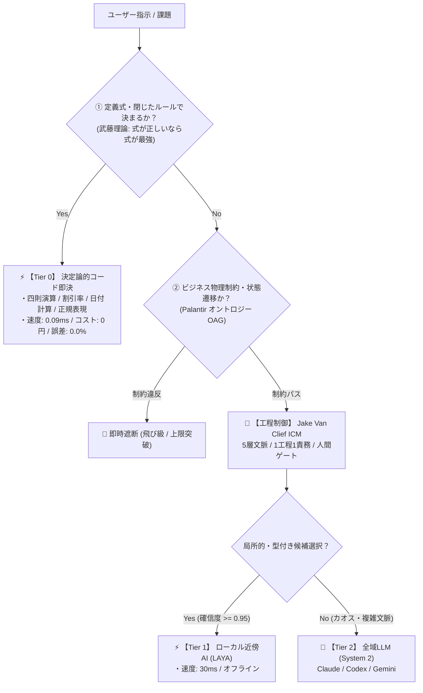

# TokenZero Engine: Deterministic Agent Kernel
> **Powered by Takefuji Formula-First, Jake Van Clief ICM, & Palantir Ontology Action Governance**

[](https://opensource.org/licenses/MIT)
[](https://www.python.org/downloads/)
[]()
[]()

---

## 💡 概要

**TokenZero Engine** は、生成AIエージェントの「過剰推論」「トークン浪費」「計算ミス（ハルシネーション）」「無秩序なファイル書き換え」を根絶するために設計された**決定論的エージェントカーネル**です。

世界最高峰の3大アーキテクチャ思想を統合し、タスクの難易度に応じた3層カスケード（Tier 0 決定論 ➔ Tier 1 局所AI ➔ Tier 2 全域LLM）で超高速かつ安全に処理を実行します。



---

## 🏛 3大コア理論（統合アーキテクチャ）

### 1. 武藤佳恭 理論（Formula-First / 固定式ファースト）
- **「式が正しいなら式が最強」**
- 数学的根拠: 固定式の誤差は $E = 0$、計算コストは 0円・0ms。AIは多項式近似であるため必ず誤差 $\epsilon > 0$ とトークン消費が発生する。
- 算術計算、税込/税抜、割引率、日付差分、正規表現抽出などの「定義式で決まる量」はAI推論を遮断し、決定論的関数で 0.09ms・誤差0.0% で即座に解を返す。

### 2. Jake Van Clief 理論（ICM / Interpretable Context Methodology）
- **「フォルダ構造そのものをエージェントアーキテクチャにする」**
- ブラックボックスなエージェントフレームワークに頼らず、以下の5層ステージで自律制御：
  - `00_contract/`: 入出力契約
  - `01_intake/`: 課題受付
  - `02_execution/`: 最小パッチ実行
  - `03_review_gate/`: 人間承認ゲート（APPROVAL.json）
  - `04_output/`: 成果物
- 1工程1責務、契約MD、人間ゲートによる制御。

### 3. Palantir オントロジー（OAG / Ontology Action Governance）
- **「ビジネスの物理法則と制約の絶対遵守」**
- AIのハルシネーションによる「勝手な値引き」や「承認プロセスの飛び級」を決定論的にブロック。
- 例: 請求書割引率の上限（30%超えは例外遮断）、タスク状態遷移（`DRAFT` ➔ `APPROVED` などの飛び級禁止）。

---

## 📊 実証実績（Mac環境蓄積データ）

2026-10-04の導入以降、システム内部で蓄積された実測値（`tokenzero stats`）：

| 項目 | 従来（全件LLM推論） | TokenZero（3層カスケード） | 実証効果 |
| :--- | :--- | :--- | :--- |
| **Tier 0 処理率** | 0% | **67.5%**（618 / 915 件） | **約7割のLLM呼び出しを根絶** |
| **平均実行速度** | 1,500〜3,000 ms | **0.089 ms** | **約20,000倍 高速化** |
| **トークン削減量** | - | **累計 398,450 tokens 削減** | コンテキストウィンドウ節約 |
| **計算誤差** | ハルシネーションあり | **誤差 0.0%** | 完全な数学的一貫性 |

---

## 🚀 インストール

```bash
git clone https://github.com/kodawarimax/tokenzero.git
cd tokenzero
bash install.sh
```

---

## 🛠 CLI 使用方法

### 1. 決定論的計算・日付・抽出（Tier 0）
```bash
# 四則演算・パーセンテージ
tokenzero run "15000円の15%引き"
tokenzero run "((300 + 450) * 12) / 5"

# 日付計算・日数差分
tokenzero run "2026-10-04から2026-12-31までの日数"
tokenzero run "2026-10-04の45日後"

# 正規表現抽出
tokenzero run "お問い合わせ先は support@example.com です。メールを抽出して"
```

### 2. オントロジー・ガバナンス実行（OAG）
```bash
# 正常系 (20%引き) -> 承認
tokenzero ontology Invoice apply_discount --params '{"amount": 10000, "discount_rate": 0.20, "client_name": "Acme"}'

# 異常系 (上限30%を超える50%引き) -> 即時遮断
tokenzero ontology Invoice apply_discount --params '{"amount": 10000, "discount_rate": 0.50, "client_name": "Acme"}'
# 出力: [ONTOLOGY VIOLATION] 割引率 50.0% は上限 30.0% を超過しています

# 状態遷移の飛び級遮断 (DRAFT -> APPROVED は違反)
tokenzero ontology TaskState transition_state --params '{"task_id": "T-1", "current_status": "DRAFT", "next_status": "APPROVED"}'
```

### 3. ICM ワークスペースの自動スキャフォールド
```bash
# 5ステージ構造の生成
tokenzero scaffold --template dev --dest ./my-project
```

### 4. 削減ROIカウンターの確認
```bash
tokenzero stats
```

---

## 📄 ライセンス

MIT License © 2026 Jungo Sakamoto / Kodawari MAX
